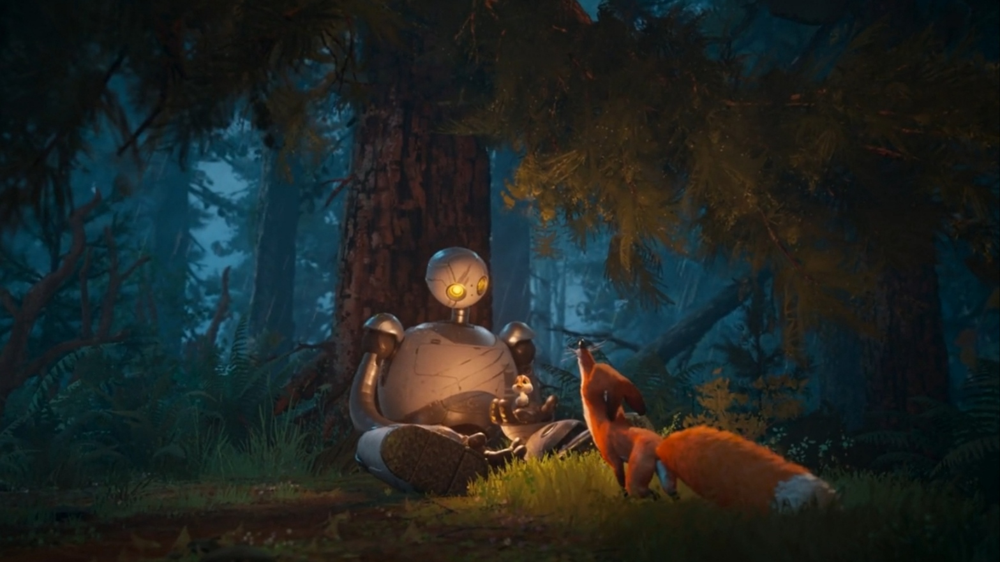

>  ***“The important thing isn't can you read music, it's can you hear it. Can you hear the music” --Niels Bohr***

|  What am I up to ? |
| ------------- | 
| ***Currently understanding the dark arts of Operating Systems because apparently "Hello World" wasn't challenging enough. Juggling C++, JavaScript, and GoLang because my left brain (cache memory) is empty enough to store all their syntax. Meanwhile, Right one was chilling with***$$\bigcup_{k=1}^{n} Pattern_k$$ |

  

### 📫 Connect

<strong>If you've got something interesting to talk</strong>

<a href="https://discord.com/channels/@ashudevcodes"><kbd></a> 
<a href="https://signal.me/#eu/oQPOyJDVfCfjKQGm3y5-qR-VdoWef77dkuCWx_ADMW6m1x3NCYpLvbFoXk6OnKXC"><kbd></a>

### 📦 Tools I use

  

<strong>PS: If you're still using spaces instead of tabs, we need to have a serious talk.</strong>

